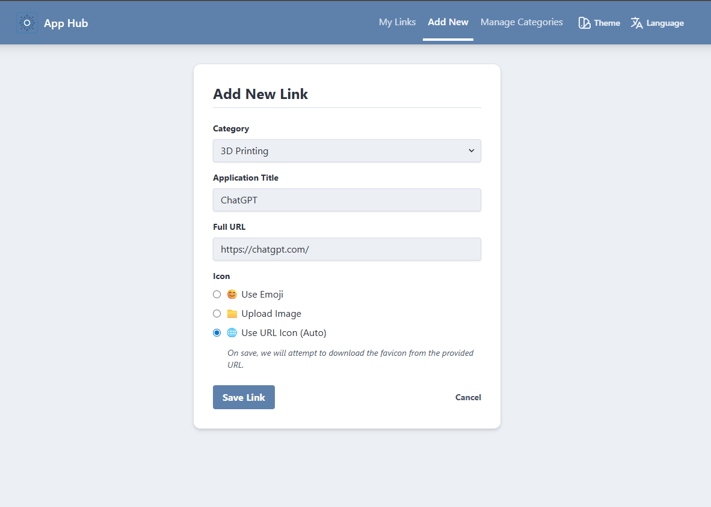
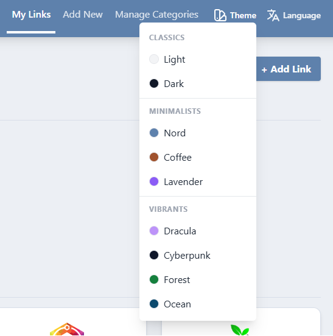

# DockLink 🚀


[](https://www.python.org/)
[](https://www.docker.com/)
[](LICENSE)

**Your Homelab, organized with style.**

Stop editing complex YAML files or running heavy dashboards that eat up your Raspberry Pi's RAM. **DockLink** is an ultra-lightweight startpage designed to be beautiful by default and dead simple to use.

## ✨ Features

*   **⚡ Lightweight & Fast:** Built with Flask and optimized for minimal resource usage (perfect for Raspberry Pi).
*   **🎨 Themable:** 8+ built-in themes including **Nord**, **Dracula**, **Cyberpunk**, and **Forest**. Switch instantly without reloading.
*   **📂 Categories:** Organize your services into clean, manageable groups.
*   **🔮 Magic Icons:** Paste a URL, and DockLink automatically fetches the best favicon (even from complex paths).
*   **🖼️ Custom Icons:** Upload your own images or use emojis if you prefer.
*   **🐳 Docker First:** Deploys in seconds. Data persists easily.

---

## 📸 Screenshots

### The Dashboard
*Your hub in action. Clean, categorized, and responsive.*


### Easy Management
*Add links, upload icons, or let us fetch them for you.*


### Beautiful Themes
*Cyberpunk, Nord, Coffee... choose your vibe.*


---

## 🚀 Quick Start (Docker Compose)

The easiest way to get started is with Docker Compose.

1.  Create a `docker-compose.yml` file:

```yaml
version: '3.8'

services:
  docklink:
    image: ghcr.io/yourusername/docklink:latest # Or build locally
    container_name: docklink
    ports:
      - "5000:5000"
    environment:
      - DB_PATH=/data/links.db
      - FLASK_APP=app.py
    volumes:
      - ./data:/data
      - ./uploads:/app/static/uploads
    restart: unless-stopped
```

2.  Run it:
    ```bash
    docker-compose up -d
    ```

3.  Open `http://localhost:5000` and start adding links!

---

## 🛠️ Manual Installation

If you prefer running without Docker (e.g., in a Python venv):

1.  **Clone the repo:**
    ```bash
    git clone https://github.com/yourusername/docklink.git
    cd docklink
    ```

2.  **Install dependencies:**
    ```bash
    python3 -m venv .venv
    source .venv/bin/activate
    pip install -r requirements.txt
    ```

3.  **Run the server:**
    ```bash
    python app.py
    ```

---

## ⚙️ Configuration

| Environment Variable | Default | Description |
| -------------------- | ------- | ----------- |
| `DB_PATH` | `links.db` (local) | Path to the SQLite database file. |
| `SECRET_KEY` | `super_secret...` | Flask secret key. Change this for production! |
| `PORT` | `5000` | Port to run the application on. |

---

## 🤝 Contributing

Contributions are what make the open-source community such an amazing place to learn, inspire, and create. Any contributions you make are **greatly appreciated**.

1.  Fork the Project
2.  Create your Feature Branch (`git checkout -b feature/AmazingFeature`)
3.  Commit your Changes (`git commit -m 'Add some AmazingFeature'`)
4.  Push to the Branch (`git push origin feature/AmazingFeature`)
5.  Open a Pull Request

## 📄 License

Distributed under the MIT License. See `LICENSE` for more information.
